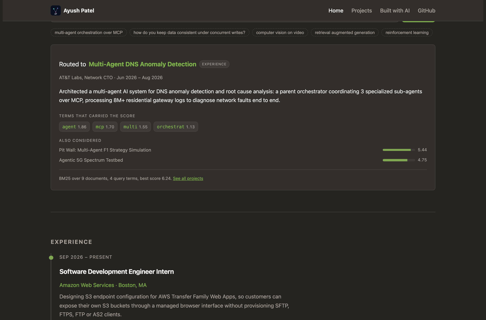

# Ayush Patel — Personal Homepage

A static personal homepage built with vanilla HTML5, CSS3 and ES6 modules. No
framework, no backend, no build step. Its centrepiece is a **BM25 retriever
over my own work**: ask it a question and it routes you to the right project,
showing the term-level scoring that decided it.

**🔗 Live site: https://ayushp2207.github.io/ayush-homepage/**
* It will be great if you can add video link, ppt link, and course link, after all of this your readme file looks perfect.


---

## Project objective

A résumé is a list of claims. "Kubernetes, PyTorch, LangChain" tells you I have
touched those things, but not _where_, _when_ or _how seriously_. Recruiters
skim for keywords; engineers want evidence.

So this site is built around one idea: **evidence, not adjectives.** Every skill
is linked to the role, project or paper where I actually used it, and the site
makes that link browsable instead of asking you to reconstruct it from prose.

---

## ⭐ The creative addition: a retriever over my own work

**This is the original component that differentiates this page.** Ask a
question in plain English and a **BM25 retriever** routes it to the right
role, project or paper — and shows you the term-level scoring that decided it.



### Why this

Most of what I actually do is routing. At AT&T a parent orchestrator picks
which of three specialist sub-agents handles a request over MCP; at the WiNES
lab I built MCP servers exposing hardware as LLM-callable tools and then
measured how often the model picked the right one; at Pibit I built the
retrieval layer that decides which documents an answer gets built from.

All three are the same problem: **score candidates against a query, pick one,
and be able to defend the choice.** So the widget is that, pointed at my own
résumé. Asking it "multi-agent orchestration over MCP" is asking the same
question my AT&T orchestrator answers, about the same kind of corpus.

### What it shows you

Not just an answer — the working:

- **Which terms carried the score**, with each one's BM25 contribution. Ask
  about MCP and you can see `mcp` contributing 1.70 while `agent` contributes
  1.86.
- **What it also considered**, with scores, so you can see how close the call
  was.
- **Which of your words it doesn't have**, so a miss is explainable rather
  than mysterious.
- **When it refuses.** Below a confidence floor it says "no confident match"
  instead of handing you the nearest document. A retriever that always returns
  its best guess is the most common way tool routing fails in production: it
  answers confidently out of the wrong document.

### How it works

[`js/retriever.js`](js/retriever.js) — no search library:

- Tokenise, drop stopwords, **suffix-stem** so "orchestrator", "orchestration"
  and "orchestrating" collapse to one term
- **BM25** ranking (`k1 = 1.5`, `b = 0.75`) with smoothed, always-positive IDF
- Per-term contribution tracking, which is what makes the explanation possible

### Why BM25 and not cosine TF-IDF

The first version scored cosine similarity over TF-IDF vectors and got a
question wrong: _"multi-agent orchestration over MCP"_ routed to **Pit Wall**
instead of the **AT&T** system. Both are genuinely multi-agent, but Pit Wall's
description is shorter, and L2 normalisation over-rewards short documents.

BM25 normalises by length relative to the corpus average instead, which is the
exact problem it was designed for. That fixed it — along with a second bug the
failure exposed: the résumé says "orchestr**ator**" while the query says
"orchestr**ation**", and the stemmer had no rule for the `-ator` agent noun, so
the two never met.

### Routing accuracy

12 of 12 on a held-out set of realistic questions, including two that
_should_ return nothing:

| Query                                                    | Routes to              |
| -------------------------------------------------------- | ---------------------- |
| multi-agent orchestration over MCP                       | AT&T DNS agents        |
| how do you keep data consistent under concurrent writes? | AWS Transfer Family    |
| computer vision on video                                 | 6G mmWave              |
| retrieval augmented generation                           | Pibit.ai               |
| kubernetes and openshift                                 | WiNES 5G testbed       |
| bayesian networks                                        | Rand-PC                |
| tell me about your favourite pizza topping               | _(no confident match)_ |
| blockchain smart contracts                               | _(no confident match)_ |

Reproduce with `npm run test:routing`.

## A second interactive piece: the Skill Constellation

On the [Projects page](projects.html), a force-directed graph wires all 23
skills and work items together — pick a skill and every place I used it stays
lit while the rest dims. Hand-written canvas code using the
Fruchterman–Reingold formulation, with the ideal edge length derived from
canvas area and node count so it lays out correctly at 396px and 1098px with
no breakpoint-specific constants.


## Tech requirements

|                         |                                                                       |
| ----------------------- | --------------------------------------------------------------------- |
| Markup                  | HTML5, semantic sectioning, **0 W3C validator errors** on all 3 pages |
| Styles                  | Hand-written CSS3 with custom properties; **zero `!important`**       |
| Grid                    | Bootstrap 5.3 grid (CSS only, via CDN with SRI) + CSS flexbox/grid    |
| Scripting               | Vanilla ES6 modules (`type="module"`), no framework, no jQuery        |
| Graph                   | Hand-written 2D canvas, no graphing library                           |
| Tooling                 | ESLint (the class config) + Prettier — **0 errors**                   |
| Dependencies at runtime | None. Bootstrap's grid stylesheet is the only external asset.         |

### Pages

| Page                                       | Purpose                                                             |
| ------------------------------------------ | ------------------------------------------------------------------- |
| [`index.html`](index.html)                 | Identity, skill constellation, experience, education, toolkit       |
| [`projects.html`](projects.html)           | Longer write-ups of projects and publications                       |
| [`built-with-ai.html`](built-with-ai.html) | The assignment's AI-generated page, used as a full GenAI disclosure |

---

## How to install and use

Requires [Node.js](https://nodejs.org/) 18 or newer.

```bash
git clone https://github.com/ayushp2207/ayush-homepage.git
cd ayush-homepage
npm install
npm start
```

Then open **http://localhost:8080**.

The site is fully static, so any static server works — `python3 -m http.server`
is fine too. You do need a server rather than opening `index.html` directly,
because ES6 modules are blocked on `file://` URLs by browser security policy.

### Other scripts

```bash
npm run lint          # ESLint with the class config
npm run lint:fix      # ESLint with autofix
npm run format        # Prettier, write
npm run format:check  # Prettier, check only
```

### Deploying

Static site with no build step, so GitHub Pages serves the repo root directly:
**Settings → Pages → Deploy from a branch → `main` / `(root)` → Save.**

---

## Project structure

```
.
├── index.html                 # Home
├── projects.html              # Projects & publications
├── built-with-ai.html         # AI-generated page / GenAI disclosure
├── css/
│   └── main.css               # All styles, organised by section
├── js/
│   ├── main.js                # Entry point: renders sections, wires nav
│   ├── data.js                # Single source of truth for all content
│   ├── retriever.js          # BM25 index and scoring (the creative addition)
│   ├── retriever-ui.js       # Query form and score breakdown
│   └── constellation.js      # Force-directed skill graph (projects page)
├── images/
│   ├── favicon.svg            # Monogram icon
│   └── screenshot-*.png       # README and design doc images
├── docs/
│   └── DESIGN.md              # Design document: personas, user stories, wireframes
├── eslint.config.js           # The class ESLint configuration
├── package.json               # "type": "module" — ES6 modules throughout
└── LICENSE                    # MIT
```

Content lives only in `js/data.js`. Both the constellation and the rendered page
sections read from it, so a role is never described in two places.

---

## Design document

**📄 [Design document (PDF)](docs/DESIGN.pdf)** &nbsp;|&nbsp;
[same content as Markdown](docs/DESIGN.md)

Covers the project description, three user personas, user stories with
acceptance criteria, information architecture, wireframes for desktop and
mobile, the design system, and a verification table.

---

## Use of GenAI

Required by the course rubric, and covered at greater length on the site's own
[Built with AI](built-with-ai.html) page.

**Tool:** [Claude Code](https://claude.com/claude-code), Anthropic's CLI coding
agent.
**Model:** Claude Opus 5 (`claude-opus-5`), 1M-context configuration.
**When:** September 2026.
**Other AI tools used:** none.

### What it was asked to do

1. Read the Project 1 assignment PDF and course slides, enumerate every rubric
   item, and separate what an agent could do from what only I could.
2. Scaffold the homepage in vanilla HTML5/CSS3/ES6 modules — no framework, no
   build step — using my résumé as the content source.
3. Propose a creative addition that wouldn't resemble other submissions, then
   implement it without a graphing library.
4. Wire up the class ESLint config and Prettier; make the markup pass the W3C
   validator.
5. Draft the design document (personas, user stories, wireframes).

### What was generated vs. hand-authored

**Generated, then reviewed by me:** the HTML skeletons, `css/main.css`, the three
ES6 modules including the force-directed layout, the `built-with-ai.html` page,
and the first draft of `docs/DESIGN.md`.

**Mine:** every factual claim on the site (roles, dates, metrics, publications —
all from my résumé, not the model); the decision that the creative addition
should be a skill-to-evidence graph; the narrated video; the code review; and the
final read-through of every file.

### Where the model was wrong

Worth recording, because it is the part people leave out:

- It **invented a Subresource Integrity hash** for the Bootstrap stylesheet
  instead of computing one. A wrong `integrity` value makes the browser refuse
  the file silently — the grid would simply not have loaded. The real hash had to
  be computed from the actual file.
- Its first constellation left a skill node with **no edges**, floating
  unconnected in the middle of the graph.
- It then **tuned the force constants twice by guessing**, producing a graph that
  first clumped into the centre and then flung every node into the corners.
  Guessing was the wrong approach; replacing the ad-hoc constants with the
  published Fruchterman–Reingold formulation fixed it properly.

---

## Author

**Ayush Nimeshkumar Patel**
MS Computer Science, Northeastern University · Boston, MA

- 🌐 Homepage: https://ayushp2207.github.io/ayush-homepage/
- 💼 LinkedIn: [linkedin.com/in/ayush-patel-912041221](https://www.linkedin.com/in/ayush-patel-912041221/)
- 💻 GitHub: [github.com/ayushp2207](https://github.com/ayushp2207)
- ✉️ ayushnpatelworks@gmail.com

## Class

Built for **[CS5610 Web Development](https://johnguerra.co/lectures/webDevelopment_fall2026/)**
at Northeastern University, taught by
[John Alexis Guerra Gómez](https://johnguerra.co/).

## Demo video

📹 _To be added before submission._

## License

[MIT](LICENSE) © 2026 Ayush Nimeshkumar Patel
