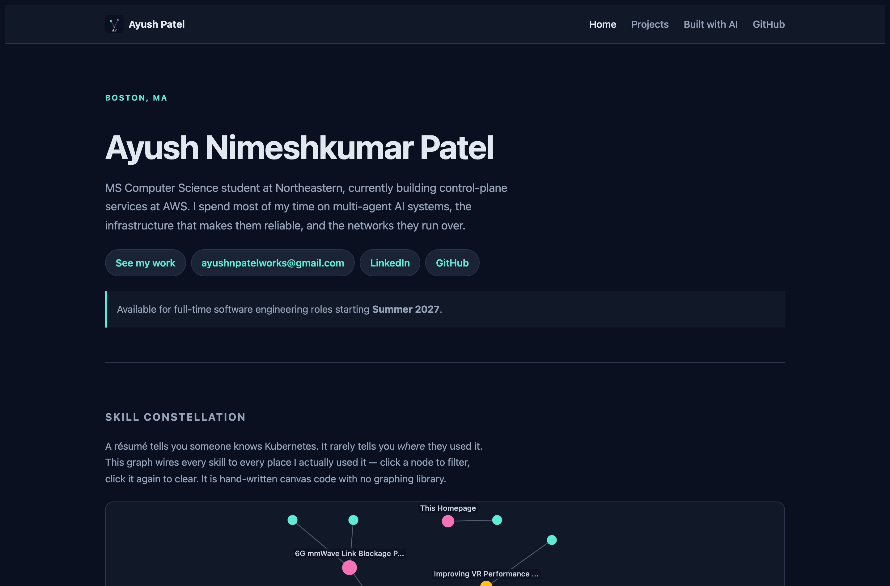
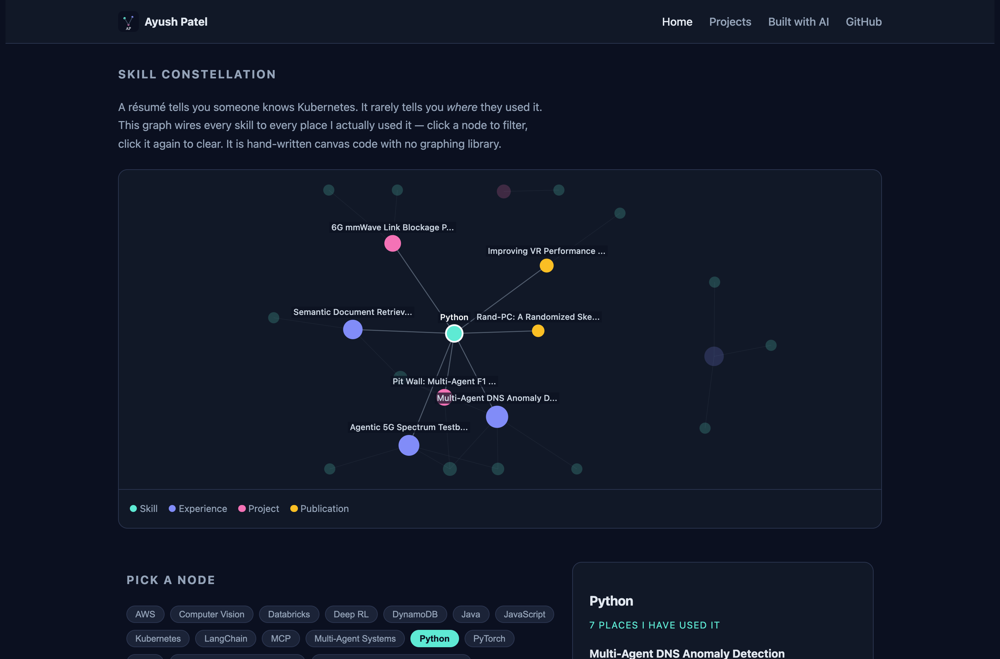

# Ayush Patel — Personal Homepage

A static personal homepage built with vanilla HTML5, CSS3 and ES6 modules. No
framework, no backend, no build step. Its centrepiece is an interactive
**Skill Constellation** that wires every skill claim to the specific work where
it was used.

**🔗 Live site: https://ayushp2207.github.io/ayush-homepage/**



---

## Project objective

A résumé is a list of claims. "Kubernetes, PyTorch, LangChain" tells you I have
touched those things, but not _where_, _when_ or _how seriously_. Recruiters
skim for keywords; engineers want evidence.

So this site is built around one idea: **evidence, not adjectives.** Every skill
is linked to the role, project or paper where I actually used it, and the site
makes that link browsable instead of asking you to reconstruct it from prose.

---

## ⭐ The creative addition: Skill Constellation

**This is the original component that differentiates this page.** It is a
force-directed graph drawn on a `<canvas>`, written from scratch — **no D3, no
Chart.js, no graph library of any kind.**



### What it does

23 nodes — 14 skills plus 9 roles, projects and publications — connected by 26
edges. Every edge means "this skill was used in this piece of work."

- **Click a skill** and every place I used it stays lit while the rest of the
  graph drops to 20% opacity. The side panel lists them and counts them:
  _"Python — 7 places I have used it."_
- **Click a role** and it works in reverse: you get that role's summary and the
  skills it was built with.
- **Click again, click empty space, or press Clear** to reset.
- **It is not mouse-only.** Every node is also a real `<button>` with
  `aria-pressed`, so the whole thing is keyboard- and screen-reader-operable.
  The canvas is never the only route to the information.

### How it works

The layout uses the Fruchterman–Reingold algorithm, implemented by hand in
[`js/constellation.js`](js/constellation.js):

- **Repulsion** between every node pair: `f = k² / d`
- **Attraction** along each edge: `f = d² / k`
- **Ideal distance** `k = 0.62 · √(area / nodeCount)`, derived from canvas size
  and node count — so the same code lays out correctly at 396px and at 1098px
  with no breakpoint-specific magic numbers
- **Cooling schedule**: a temperature caps per-node movement each frame and
  decays 2.5% per step, so the graph converges instead of oscillating forever
- **Animation stops** once total movement falls below a threshold, so an idle
  tab burns no CPU
- **Labels** are drawn in a second pass in priority order with
  rectangle-collision detection; a label that would overlap one already drawn is
  skipped. (The first version drew all 23 labels at once and they piled into an
  illegible heap.)
- Under `prefers-reduced-motion: reduce`, the layout is solved silently and
  painted once, with no animation.

One thing the graph reveals that I did not design for: the AWS role floats in
its own cluster, because Java, DynamoDB and AWS aren't shared with any other
entry. That is truthful, and arguably the most informative thing it says.

---

## Tech requirements

|                         |                                                                       |
| ----------------------- | --------------------------------------------------------------------- |
| Markup                  | HTML5, semantic sectioning, **0 W3C validator errors** on all 3 pages |
| Styles                  | Hand-written CSS3 with custom properties; **zero `!important`**       |
| Grid                    | Bootstrap 5.3 grid (CSS only, via CDN with SRI) + CSS flexbox/grid    |
| Scripting               | Vanilla ES6 modules (`type="module"`), no framework, no jQuery        |
| Graph                   | Hand-written 2D canvas, no graphing library                           |
| Tooling                 | ESLint (the class config) + Prettier — **0 errors**                   |
| Dependencies at runtime | None. Bootstrap's grid stylesheet is the only external asset.         |

### Pages

| Page                                       | Purpose                                                             |
| ------------------------------------------ | ------------------------------------------------------------------- |
| [`index.html`](index.html)                 | Identity, skill constellation, experience, education, toolkit       |
| [`projects.html`](projects.html)           | Longer write-ups of projects and publications                       |
| [`built-with-ai.html`](built-with-ai.html) | The assignment's AI-generated page, used as a full GenAI disclosure |

---

## How to install and use

Requires [Node.js](https://nodejs.org/) 18 or newer.

```bash
git clone https://github.com/ayushp2207/ayush-homepage.git
cd ayush-homepage
npm install
npm start
```

Then open **http://localhost:8080**.

The site is fully static, so any static server works — `python3 -m http.server`
is fine too. You do need a server rather than opening `index.html` directly,
because ES6 modules are blocked on `file://` URLs by browser security policy.

### Other scripts

```bash
npm run lint          # ESLint with the class config
npm run lint:fix      # ESLint with autofix
npm run format        # Prettier, write
npm run format:check  # Prettier, check only
```

### Deploying

Static site with no build step, so GitHub Pages serves the repo root directly:
**Settings → Pages → Deploy from a branch → `main` / `(root)` → Save.**

---

## Project structure

```
.
├── index.html                 # Home
├── projects.html              # Projects & publications
├── built-with-ai.html         # AI-generated page / GenAI disclosure
├── css/
│   └── main.css               # All styles, organised by section
├── js/
│   ├── main.js                # Entry point: renders sections, wires nav
│   ├── constellation.js       # The creative addition (force-directed graph)
│   └── data.js                # Single source of truth for all content
├── images/
│   ├── favicon.svg            # Monogram icon
│   └── screenshot-*.png       # README and design doc images
├── docs/
│   └── DESIGN.md              # Design document: personas, user stories, wireframes
├── eslint.config.js           # The class ESLint configuration
├── package.json               # "type": "module" — ES6 modules throughout
└── LICENSE                    # MIT
```

Content lives only in `js/data.js`. Both the constellation and the rendered page
sections read from it, so a role is never described in two places.

---

## Design document

Personas, user stories with acceptance criteria, wireframes, the design system
and the verification table are in **[docs/DESIGN.md](docs/DESIGN.md)**.

---

## Use of GenAI

Required by the course rubric, and covered at greater length on the site's own
[Built with AI](built-with-ai.html) page.

**Tool:** [Claude Code](https://claude.com/claude-code), Anthropic's CLI coding
agent.
**Model:** Claude Opus 5 (`claude-opus-5`), 1M-context configuration.
**When:** September 2026.
**Other AI tools used:** none.

### What it was asked to do

1. Read the Project 1 assignment PDF and course slides, enumerate every rubric
   item, and separate what an agent could do from what only I could.
2. Scaffold the homepage in vanilla HTML5/CSS3/ES6 modules — no framework, no
   build step — using my résumé as the content source.
3. Propose a creative addition that wouldn't resemble other submissions, then
   implement it without a graphing library.
4. Wire up the class ESLint config and Prettier; make the markup pass the W3C
   validator.
5. Draft the design document (personas, user stories, wireframes).

### What was generated vs. hand-authored

**Generated, then reviewed by me:** the HTML skeletons, `css/main.css`, the three
ES6 modules including the force-directed layout, the `built-with-ai.html` page,
and the first draft of `docs/DESIGN.md`.

**Mine:** every factual claim on the site (roles, dates, metrics, publications —
all from my résumé, not the model); the decision that the creative addition
should be a skill-to-evidence graph; the narrated video; the code review; and the
final read-through of every file.

### Where the model was wrong

Worth recording, because it is the part people leave out:

- It **invented a Subresource Integrity hash** for the Bootstrap stylesheet
  instead of computing one. A wrong `integrity` value makes the browser refuse
  the file silently — the grid would simply not have loaded. The real hash had to
  be computed from the actual file.
- Its first constellation left a skill node with **no edges**, floating
  unconnected in the middle of the graph.
- It then **tuned the force constants twice by guessing**, producing a graph that
  first clumped into the centre and then flung every node into the corners.
  Guessing was the wrong approach; replacing the ad-hoc constants with the
  published Fruchterman–Reingold formulation fixed it properly.

---

## Author

**Ayush Nimeshkumar Patel**
MS Computer Science, Northeastern University · Boston, MA

- 🌐 Homepage: https://ayushp2207.github.io/ayush-homepage/
- 💼 LinkedIn: [linkedin.com/in/ayush-patel](https://linkedin.com/in/ayush-patel)
- 💻 GitHub: [github.com/ayushp2207](https://github.com/ayushp2207)
- ✉️ ayushnpatelworks@gmail.com

## Class

Built for **[CS5610 Web Development](https://johnguerra.co/lectures/webDevelopment_fall2026/)**
at Northeastern University, taught by
[John Alexis Guerra Gómez](https://johnguerra.co/).

## Demo video

📹 _To be added before submission._

## License

[MIT](LICENSE) © 2026 Ayush Nimeshkumar Patel
