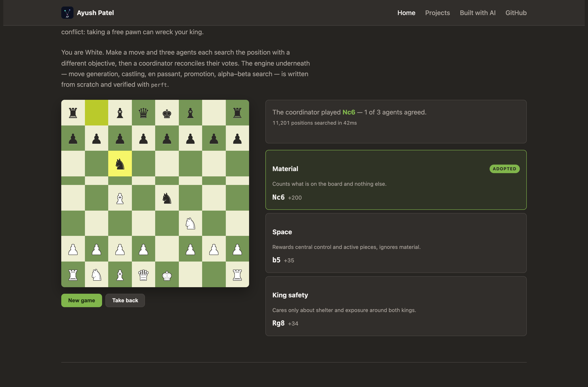
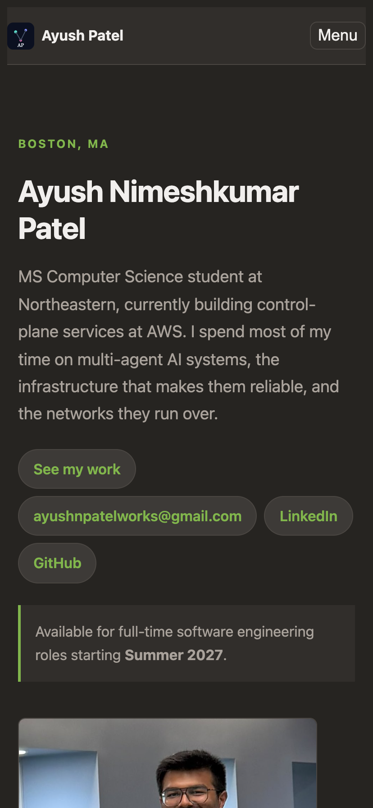

# Design Document — Personal Homepage

**Author:** Ayush Nimeshkumar Patel
**Course:** [CS5610 Web Development](https://johnguerra.co/lectures/webDevelopment_fall2026/), Northeastern University
**Project:** Project 1 — Your personal home page
**Live site:** https://ayushp2207.github.io/ayush-homepage/
**Repository:** https://github.com/ayushp2207/ayush-homepage
**PDF version:** [DESIGN.pdf](DESIGN.pdf)

---

## 1. Project description

### What this is

A static personal homepage built with vanilla HTML5, CSS3 and ES6 modules. No
backend, no framework, no component library, no build step. Bootstrap 5 is used
for its grid only; every other style is hand-written.

### The problem it solves

A résumé is a list of claims. "Kubernetes, PyTorch, LangChain" tells a reader
that I have touched those things, but not _where_, _when_, or _how seriously_.
Recruiters skim for keywords; engineers want evidence. The two audiences need the
same facts presented at different depths, and a flat list of bullet points serves
neither well.

So the organising idea of this site is **evidence, not adjectives**. Every skill
claim is wired to the specific role, project or paper where I used it, and the
site makes that wiring browsable rather than asking the reader to reconstruct it
from prose.

### Scope

Three pages:

| Page          | URL                  | Purpose                                                             |
| ------------- | -------------------- | ------------------------------------------------------------------- |
| Home          | `index.html`         | Identity, the skill constellation, experience, education, toolkit   |
| Projects      | `projects.html`      | Longer write-ups of projects and publications                       |
| Built with AI | `built-with-ai.html` | The assignment's AI-generated page, used as a full GenAI disclosure |

### Non-goals

- No blog or CMS. Content lives in one JavaScript module and is edited by hand.
- No contact form, because that would need a backend.
- No dark/light toggle. The site commits to one dark palette and does it well.

---

## 2. User personas

### Persona 1 — Priya, technical recruiter

- **Role:** University recruiter at a cloud infrastructure company.
- **Context:** Screening ~120 candidates for summer internships. Roughly 40
  seconds per profile on the first pass, on a laptop with a dozen tabs open.
- **Goals:** Confirm graduation date, work authorisation timing, and whether the
  candidate has shipped anything at production scale.
- **Frustrations:** Portfolios that open with a full-screen animation and bury
  the graduation date three scrolls down. Having to open a PDF to learn anything
  concrete.
- **What she needs from this site:** Name, current role, graduation date and
  availability visible without scrolling. One click to email.

### Persona 2 — Daniel, engineering hiring manager

- **Role:** Senior engineer who will run the technical interview.
- **Context:** Already read the résumé and is deciding whether to spend an hour
  on a phone screen. Reads carefully, and is sceptical of inflated claims.
- **Goals:** Find out whether the candidate's "multi-agent systems" experience is
  a tutorial project or real work; see actual code.
- **Frustrations:** Skill bars showing "Python 90%". Project cards with a title,
  a logo and no explanation of what was actually built or how hard it was.
- **What he needs from this site:** The ability to pick a technology and
  immediately see every place it was used, with enough detail to form a question.
  A link to source.

### Persona 3 — Meera, fellow student and peer reviewer

- **Role:** Classmate assigned to review this submission.
- **Context:** On a phone, between classes, working through a rubric.
- **Goals:** Check the rubric items — semantic markup, responsive layout, alt
  text, original JS, MIT license, README quality.
- **Frustrations:** Sites that only work at desktop width. Creative additions
  that turn out to be a copied library demo.
- **What she needs from this site:** A layout that holds up at 390px, a clearly
  identified creative addition, and an honest statement of what was generated.

---

## 3. User stories

Written as stories with acceptance criteria, so each one is testable.

### Epic A — Establish identity fast

**A1.** _As Priya, screening quickly, I want the candidate's name, current role
and availability without scrolling, so I can triage in seconds._

- Given a 1440×900 desktop viewport
- When the homepage loads
- Then the name, a one-sentence summary, and "Available … starting Summer 2027"
  are all visible above the fold
- And an email link is reachable in one click

**A2.** _As Priya, I want to know where the candidate studies and when they
graduate, so I can match them to a requisition._

- Given the homepage
- When I reach the Education section
- Then each degree shows institution, degree name, expected date and location

### Epic B — Show how I actually think

**B1.** _As Daniel, I want to see the candidate's architectural thinking, not
just a list of technologies._

- Given the agent board on the homepage
- When I make a move
- Then three agents each report a different recommended reply with a score
- And the coordinator states how many of them it agreed with
- So the disagreement itself is the visible output

**B2.** _As Daniel, I want to know the chess engine is real and not a library._

- Given the repository
- Then `js/chess/engine.js` contains the move generator
- And the README publishes perft node counts against known values

**B3.** _As Meera on a phone, I want to use the board without a mouse._

- Given a touch device or keyboard-only navigation
- When I Tab to a square and press Enter
- Then that piece is selected and its legal destinations are marked
- And every square announces its name and occupant to a screen reader

**B4.** _As anyone, I want to undo a bad move rather than restart._

- Given at least one completed exchange
- When I press "Take back"
- Then my move and the coordinator's reply are both undone

**B5.** _As Daniel, I want to find where a given skill was used._

- Given the skill constellation on the Projects page
- When I select "Kubernetes"
- Then every role and project using it is listed, and unrelated nodes dim

### Epic C — Depth on demand

**C1.** _As Daniel, I want longer write-ups than a résumé bullet, so I can
prepare questions._

- Given the Projects page
- Then each entry has a summary plus specific detail points
- And publications are listed with venue and status

### Epic D — Work everywhere, for everyone

**D1.** _As Meera on a 390px phone, I want a usable layout._

- Given a 390px viewport
- Then the page never scrolls horizontally
- And the navigation collapses behind a labelled Menu button
- And the constellation still renders and responds

**D2.** _As a keyboard user, I want to skip repeated navigation._

- Given focus at the top of the document
- When I press Tab once
- Then a "Skip to main content" link appears and is focusable

**D3.** _As a screen reader user, I want the graph not to be a dead end._

- Given the canvas
- Then it exposes `role="img"` and a description saying the same nodes exist as
  buttons below

**D4.** _As someone with vestibular sensitivity, I don't want a graph animating
at me._

- Given `prefers-reduced-motion: reduce`
- Then the layout is computed without animating and painted once

### Epic E — Academic honesty

**E1.** _As the grader, I want to know exactly which parts were AI-generated._

- Given the "Built with AI" page
- Then it names the model and version, lists what was asked, separates generated
  from hand-authored content, and records where the model was wrong

---

## 4. Information architecture

```
index.html ............. Home
├── Hero ............... name, one-line pitch, contact, availability
├── Agent chess board .. the creative addition
├── Experience ......... reverse-chronological timeline (4 roles)
├── Education .......... 2 degrees
└── Toolkit ............ grouped skill lists
projects.html .......... Projects + Publications + skill constellation
built-with-ai.html ..... GenAI disclosure (the AI-generated page)
```

All three pages share one persistent header and footer. Content is defined once
in `js/data.js`; the constellation and the rendered sections both read from it,
so a role is never described in two places.

---

## 5. Design mockups

Wireframes produced before implementation. Final screenshots follow in section 8.

### 5.1 Home — desktop (≥ 992px)

```
┌───────────────────────────────────────────────────────────────────────┐
│ [AP] Ayush Patel            Home   Projects   Built with AI   GitHub │  sticky
├───────────────────────────────────────────────────────────────────────┤
│                                                                       │
│  BOSTON, MA                                                           │
│  Ayush Nimeshkumar Patel                          <- h1, clamp()      │
│  MS CS at Northeastern, currently building control-plane              │
│  services at AWS. Multi-agent AI systems and the                      │
│  infrastructure that makes them reliable.                             │
│                                                                       │
│  ( See my work ) ( email ) ( LinkedIn ) ( GitHub )    <- pill links   │
│                                                                       │
│  ▏Available for full-time roles starting Summer 2027  <- accent rule  │
│                                                                       │
├───────────────────────────────────────────────────────────────────────┤
│  SKILL CONSTELLATION                                                  │
│  A résumé tells you someone knows Kubernetes. It rarely tells         │
│  you where they used it.                                              │
│  ┌─────────────────────────────────────────────────────────────────┐  │
│  │            ○ Databricks                                         │  │
│  │      ●────────┘      ╲                                          │  │
│  │   DNS Agents          ○ MCP ──── ● 5G Testbed                   │  │
│  │      ╲                 │                                        │  │
│  │       ◉ Python ────────┴──── ● Pibit                            │  │
│  │      ╱   ╲                                                      │  │
│  │  ◆ Pit Wall  ◇ Rand-PC                                          │  │
│  │                                                                 │  │
│  ├─────────────────────────────────────────────────────────────────┤  │
│  │ ● Skill  ● Experience  ● Project  ● Publication                 │  │
│  └─────────────────────────────────────────────────────────────────┘  │
│                                                                       │
│  PICK A NODE                          ┌──────────────────────────┐    │
│  (AWS)(Computer Vision)(Databricks)   │ Python                   │    │
│  (Deep RL)(DynamoDB)(Java)(Python)    │ 7 PLACES I HAVE USED IT  │    │
│  (Kubernetes)(LangChain)(MCP) ...     │ ─ DNS Anomaly Detection  │    │
│  ( Clear selection )                  │ ─ 5G Spectrum Testbed    │    │
│                                       │ ─ Pit Wall               │    │
│         7 cols                        └──────── 5 cols ──────────┘    │
├───────────────────────────────────────────────────────────────────────┤
│  EXPERIENCE                                                           │
│  ●─ SEP 2026 – PRESENT                                                │
│  │  Software Development Engineer Intern                              │
│  │  Amazon Web Services · Boston, MA                                  │
│  │  Designing S3 endpoint configuration for Transfer Family…          │
│  ●─ JUN 2026 – AUG 2026                                               │
│  │  AI Engineer Intern …                                              │
├───────────────────────────────────────────────────────────────────────┤
│  EDUCATION            │  TOOLKIT                                      │
├───────────────────────────────────────────────────────────────────────┤
│  © 2026 Ayush Patel · Built for CS5610 · Home Projects Source         │
└───────────────────────────────────────────────────────────────────────┘
```

### 5.2 Home — mobile (< 768px)

Single column throughout. Nav collapses; the constellation keeps its full
interaction but shortens to 340px tall; the detail panel stacks under the chips.

```
┌───────────────────────────┐
│ [AP] Ayush Patel   (Menu) │
├───────────────────────────┤
│ BOSTON, MA                │
│ Ayush Nimeshkumar         │
│ Patel                     │
│ MS CS at Northeastern,    │
│ currently building…       │
│ ( See my work )           │
│ ( email ) ( LinkedIn )    │
│ ▏Available Summer 2027    │
├───────────────────────────┤
│ SKILL CONSTELLATION       │
│ ┌───────────────────────┐ │
│ │   ○──●   ◉ Python     │ │
│ │  ╱   ╲ ╱   ╲          │ │
│ │ ●     ○     ◆         │ │
│ ├───────────────────────┤ │
│ │ ●Skill ●Exp ●Proj     │ │
│ └───────────────────────┘ │
│ PICK A NODE               │
│ (AWS)(CV)(Databricks)     │
│ (Deep RL)(DynamoDB) ...   │
│ ┌───────────────────────┐ │
│ │ Python                │ │
│ │ 7 PLACES              │ │
│ └───────────────────────┘ │
├───────────────────────────┤
│ EXPERIENCE                │
│ ●─ SEP 2026 – PRESENT     │
│ │  SDE Intern             │
│ │  Amazon Web Services    │
└───────────────────────────┘
```

Nav open state:

```
┌───────────────────────────┐
│ [AP] Ayush Patel   (Menu) │  aria-expanded="true"
│ Home                      │
│ Projects                  │
│ Built with AI             │
│ GitHub                    │
└───────────────────────────┘
```

### 5.3 Projects — desktop

Two-column card grid (`col-12 col-lg-6`), collapsing to one column on mobile.

```
┌───────────────────────────────────────────────────────────────────────┐
│  SELECTED WORK                                                        │
│  Projects & Publications                                              │
│  Things I built or wrote up, in more detail than a résumé bullet.      │
├───────────────────────────────────────────────────────────────────────┤
│  PROJECTS                                                             │
│  ┌──────────────────────────────┐ ┌──────────────────────────────┐    │
│  │ PROJECT                      │ │ PROJECT                      │    │
│  │ Pit Wall: Multi-Agent F1     │ │ 6G mmWave Link Blockage      │    │
│  │ Personal project · Aug 2025  │ │ Research project · Jul 2024  │    │
│  │ Orchestrated 5 Llama 3       │ │ CNN-LSTM in PyTorch that     │    │
│  │ agents through AutoGen…      │ │ forecasts blockage…          │    │
│  │ • each agent argues a        │ │ • convolutional extractor    │    │
│  │   position…                  │ │   plus recurrent head        │    │
│  └──────────────────────────────┘ └──────────────────────────────┘    │
├───────────────────────────────────────────────────────────────────────┤
│  PUBLICATIONS                                                         │
│  ┌──────────────────────────────┐ ┌──────────────────────────────┐    │
│  │ PUBLICATION                  │ │ PUBLICATION                  │    │
│  │ Improving VR Performance…    │ │ Rand-PC: A Randomized…       │    │
│  └──────────────────────────────┘ └──────────────────────────────┘    │
└───────────────────────────────────────────────────────────────────────┘
```

### 5.4 Constellation interaction states

```
Default (nothing selected)          Selected: "Python"
┌──────────────────────────┐        ┌──────────────────────────┐
│  all nodes full opacity  │        │  Python ringed white     │
│  hub labels only         │  ───▶  │  7 neighbours full       │
│  edges at 50% grey       │ click  │  others at 20% opacity   │
│                          │        │  their edges at 9%       │
│  panel: "Pick a skill…"  │        │  panel: 7 places listed  │
└──────────────────────────┘        └──────────────────────────┘
        ▲                                      │
        └────────── click again / Clear ───────┘
```

---

## 6. Design system

### Palette

Borrowed from chess.com, because the board is the centrepiece and the rest of
the page should look like it belongs to the same product. Warm near-black
rather than blue-black, so the board's greens sit naturally on it, with a
single bright green carrying every call to action.

| Token              | Value                 | Use                          |
| ------------------ | --------------------- | ---------------------------- |
| `--ink`            | `#262421`             | Page background (warm black) |
| `--surface`        | `#312e2b`             | Cards, nav, status panel     |
| `--surface-raised` | `#3d3a37`             | Pills, chips, buttons        |
| `--line`           | `#4a4642`             | All borders and rules        |
| `--text`           | `#f1efed`             | Body text                    |
| `--text-muted`     | `#a9a29b`             | Secondary text               |
| `--accent`         | `#81b64c`             | Links, primary buttons       |
| `--board-light`    | `#eeeed2`             | Light squares                |
| `--board-dark`     | `#769656`             | Dark squares                 |
| `--board-*-active` | `#f6f669` / `#baca2b` | Last-move highlight          |
| `--warn`           | `#e0a63c`             | "No preference" notices      |

Only one hue does the accent work. Everything that is interactive is green;
nothing decorative is. That is what keeps a dark page from turning muddy.

### Type and spacing

System font stack, so there is no web-font round trip. The `h1` uses
`clamp(2.1rem, 6vw, 3.4rem)` to scale without breakpoints. Body copy is capped
at `58–70ch` for readability. Spacing is a six-step scale
(`0.25/0.5/1/1.5/2.5/4rem`) exposed as custom properties, so vertical rhythm
stays consistent.

### CSS conventions

- Every element is targeted by **class**, never by id, and never by bare tag
  beyond base resets.
- **Zero `!important`** in the stylesheet (verified: `grep -c '!important'` → 0).
- Layout uses Bootstrap's grid plus CSS flexbox and grid. One deliberate
  override: `.page-wrap .row` zeroes Bootstrap's negative gutters, because
  `.page-wrap` is not a Bootstrap `.container` and the negative margins
  otherwise cause horizontal overflow on mobile.

### Accessibility decisions

| Concern                      | Decision                                                        |
| ---------------------------- | --------------------------------------------------------------- |
| Keyboard access to the graph | Every node is also a real `<button>` with `aria-pressed`        |
| Screen readers               | Canvas is `role="img"` with a label pointing at the button list |
| Skip navigation              | `.skip-link`, off-screen until focused                          |
| Focus visibility             | One shared `:focus-visible` outline, 3px, offset 3px            |
| Motion sensitivity           | `prefers-reduced-motion` settles the layout without animating   |
| Semantic controls            | Buttons are `<button>`, links are `<a>` — no clickable `<div>`  |
| Images                       | Every `` carries a real `alt`                              |

---

## 7. The creative addition: an agent committee that plays chess

### Why this and not a honeycomb grid

The assignment's own example is a honeycomb image grid, so that is the one
thing guaranteed to appear in other submissions. More importantly, a
decorative grid says nothing about how I actually work.

At AT&T I built a multi-agent system where one orchestrator coordinates three
specialist sub-agents over MCP, and the useful signal there was never the
final answer &mdash; it was **where the specialists disagreed**. This widget is
that architecture, shrunk to something you can play with in ten seconds.

Chess is an honest demonstration domain because the objectives genuinely
conflict: grabbing a free pawn can wreck your king. A committee that always
agrees would teach nothing.

### The engine

Written from scratch in `js/chess/engine.js`, with no chess library:

- **0x88 board representation** — off-board detection is a single bit test
- **Fully legal move generation** — castling (including through and out of
  check), en passant, promotion, pins, checkmate and stalemate
- **Make / unmake** with a history stack, so the search never copies the board
- **Alpha–beta negamax** with capture-first move ordering

### The agents

| Agent       | Objective                                  | Deliberately ignores |
| ----------- | ------------------------------------------ | -------------------- |
| Material    | Piece values only                          | Position entirely    |
| Space       | Central control, piece activity            | Material entirely    |
| King safety | Shelter, exposure, distance from home rank | Material entirely    |

Each searches independently to depth 3 with its own evaluation. A coordinator
then searches with a weighted blend (1.0 / 0.35 / 0.55) and picks the move.
The panel reports how many agents the coordinator agreed with.

### Honest reporting of indifference

A pure material agent has **no opinion** in a quiet opening — every move scores
zero. Rather than present an arbitrary pick as a recommendation, the agent
says so.

This was a bug first. The original test was "top move ties with second", which
wrongly flagged an agent as indifferent when its two _best_ moves tied — the
agent that had just found a way to win a pawn was reported as having no
preference. Real indifference is when _every_ move scores the same.

### How correctness is established

A move generator can be subtly wrong in ways no amount of playing by hand will
reveal. So the engine is verified with **perft** — counting leaf nodes of the
move tree to a fixed depth against published values:

| Position          | Depth | Expected | Result |
| ----------------- | ----- | -------- | ------ |
| Start position    | 4     | 197,281  | pass   |
| Kiwipete          | 3     | 97,862   | pass   |
| En passant / pins | 4     | 43,238   | pass   |
| Promotions        | 3     | 9,467    | pass   |
| Position 5        | 3     | 62,379   | pass   |

The engine was perft-verified **before any interface was built on top of it**.

### Accessibility

Every square is a real `<button>` in a grid with an `aria-label` naming the
square and its occupant, so the board is fully keyboard-operable and legible
to a screen reader. Pieces are Unicode glyphs; there is no sprite sheet.

Performance is roughly 12,000 positions in ~50ms, so no web worker is needed.

## 7b. Second interactive piece: Skill Constellation

Moved to the Projects page. A force-directed graph wiring all 23 skills and
work items together: pick a skill and every place I used it stays lit while
the rest dims.

Layout uses Fruchterman–Reingold: repulsion `k²/d`, attraction `d²/k`, ideal
distance `k = 0.62·√(area / nodeCount)` derived from canvas size and node
count, and a cooling temperature so it converges. Labels are drawn in a second
pass with rectangle-collision detection.

## 8. Final implementation

### Home — hero


### The agent board mid-game



Each agent reports its own recommendation and score; the one the coordinator
adopted is outlined in green.

### Skill constellation, Projects page


### Mobile



---

## 9. Verification

| Check                      | Method                               | Result       |
| -------------------------- | ------------------------------------ | ------------ |
| W3C validity               | `validator.w3.org/nu` on all 3 pages | **0 errors** |
| ESLint (class config)      | `npx eslint .`                       | **0 errors** |
| Prettier                   | `npx prettier --check`               | clean        |
| Console errors             | Headless Chrome, all 3 pages         | **none**     |
| Images have alt            | DOM audit                            | 0 missing    |
| Horizontal scroll at 390px | `scrollWidth` vs `innerWidth`        | none         |
| Keyboard filtering         | Tab + Enter on node list             | works        |
| `!important` count         | `grep -c` on the stylesheet          | 0            |
